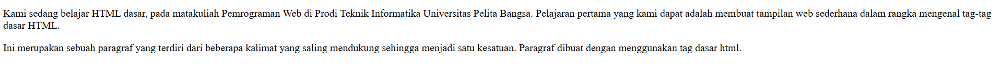
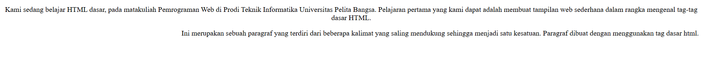
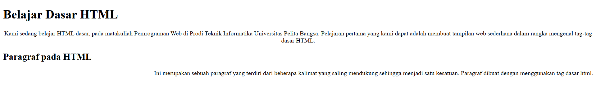
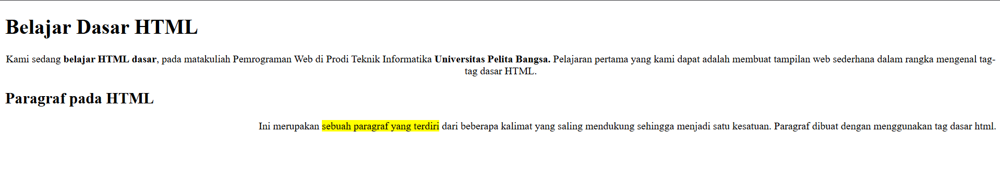
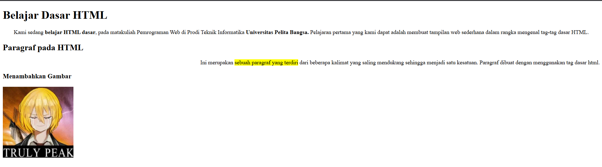
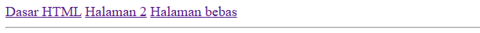

# Praktikum 1: Dasar HTML

## Nama: Albhani Fadillah Haryady
## NIM: 312410130
## Kelas: TI 24 A1

### 1. Membuat Paragraf
Di langkah pertama, kita belajar cara membuat paragraf dengan tag `<p>`. Paragraf dipakai untuk menuliskan teks agar lebih rapi dan terstruktur.

```html
<p>Kami sedang belajar HTML dasar pada matakuliah Pemrograman Web di Prodi
Teknik Informatika Universitas Pelita Bangsa. Pelajaran pertama yang kami dapat
adalah membuat tampilan web sederhana dalam rangka mengenal tag-tag dasar HTML.</p>

<p>Ini merupakan sebuah paragraf yang terdiri dari beberapa kalimat yang saling
mendukung sehingga menjadi satu kesatuan. Paragraf dibuat dengan menggunakan
tag dasar html.</p>
```

### setelah diatur atribut paragrafnya


### 2. Menambahkan Judul
Di HTML ada heading dari h1 sampai h6. Fungsinya buat bikin judul utama dan subjudul.
- h1 biasanya dipakai untuk judul besar.
- h2 dipakai untuk subjudul.
- h3 sampai h6 dipakai untuk judul tingkat lebih kecil.
Dengan heading, teks jadi lebih terstruktur dan enak dibaca.

Contoh:
```html
<h1>Belajar Dasar HTML</h1>
<h2>Paragraf pada HTML</h2>
```


### 3. Memformat Teks
HTML juga punya tag buat memformat teks supaya tampilannya beda.
Beberapa contoh:
- b atau strong → bikin teks tebal
- i atau em → bikin teks miring
- u → bikin teks bergaris bawah

Fungsinya biar tulisan lebih jelas, misalnya buat menekankan kata penting atau bikin tampilan lebih rapi.

Contoh:


### 4. Menyisipkan Gambar
Supaya web nggak cuma tulisan doang, kita bisa masukin gambar dengan tag img.
Hal yang perlu diperhatikan:
- Gambar harus ada di folder yang sama dengan file HTML, atau bisa juga dari link internet.
- Bisa ditambah atribut width atau height untuk ngatur ukuran.
- Bisa juga pakai title dan alt untuk keterangan gambar.

Contoh:
```html
<h3>Menambahkan Gambar</h3>

``` 


### 5. Menyisipkan Gambar
Hyperlink dipakai untuk berpindah ke halaman lain atau website lain.
Caranya pakai tag a dengan atribut href untuk tujuan link.

Contoh:
```html
<a href="lab1_tag_dasar.html">Dasar HTML</a>
<a href="lab1_halaman2.html">Halaman 2</a>
<a href="https://steamcommunity.com/profiles/76561199343340249/">Halaman bebas</a>
```


### halaman 2


1. Lakukan perubahan pada kode sesuai dengan keinginan anda, amati perubahannya adakah
error ketika terjadi kesalahan penulisan tag?
- Tidak muncul pesan error, tapi hasil tampilan bisa berantakan atau tidak sesuai.
2. Apa perbedaan dari tag <p> dengan tag <br>, berikan penjelasannya!

- <p> = bikin paragraf baru dengan jarak atas-bawah.
- <br> = cuma pindah baris dalam paragraf.
3. Apa perbedaan atribut title dan alt pada tag , berikan penjelasannya!

- title = tooltip saat kursor diarahkan ke gambar.
- alt = teks pengganti kalau gambar gagal dimuat + aksesibilitas screen reader.

4. Untuk mengatur ukuran gambar, digunakan atribut width dan height. Agar tampilan gambar
proporsional sebaiknya kedua atribut tersebut diisi semua atau tidak? Berikan penjelasannya!

- Cukup isi salah satunya (misalnya width). Kalau isi dua-duanya dengan angka sembarangan, gambar bisa jadi gepeng.

5. Pada link tambahkan atribut target dengan nilai atribut bervariasi ( _blank, _self, _top,
_parent ), apa yang terjadi pada masing-masing nilai antribut tersebut?
- _blank → buka link di tab/jendela baru
- _self → buka link di tab yang sama
- _top → buka link di seluruh jendela (hapus frame/iframe)
- _parent → buka link di frame induk